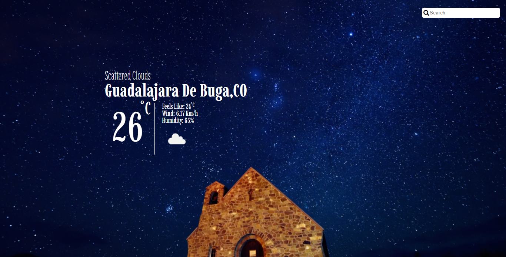

# Weather app

Weather app created using [openWeather](https://openweathermap.org/) API, Where users can access weather information about the location given in the top search bar.




## Built With

- Javascript
- Webpack
- HTML
- CSS 

## Live Demo

[Live Demo Link](https://shaqri.github.io/Weather_app/)

## Getting Started

To get a local copy up and running follow these simple example steps.

- Git clone https://github.com/Shaqri/Weather_app.git
- Install all npm dependencies by running:
```
$npm install 
```
>> if you don't know what npm is, you can read what it is about [here](https://docs.npmjs.com/about-npm) and to get it up and running in your computer, follow this [guide](https://docs.npmjs.com/cli/v6/commands/npm-install) from the npm docs.


- Open the index.html inside the dist folder with your favorite browser
- Explore the weather from all different parts of the world you can imagine.

To open the app remotely, just go and try the demo link above.

## Use your API key

If you want to add your own API key from the openWeather API, you can do so by creating a file in the root folder called '.env' and set your API key by following the example in .env-sample. 

### Usage

- Cities can be searched by their name, or if you want to be more specific, you can type the name, state, and country space separated in the search bar input.

- If the inputted city is mistyped, doesn't exist, or simply the API request is not reaching that city weather information, the app will display an error below the search input.

## Author

👤 Victor Gonzalez

- Github: [@Shaqri](https://github.com/shaqri)
- Twitter: [@victorgonbu1](https://twitter.com/Victorgonbu1)
- LinkedIn: [Victor Gonzalez](https://www.linkedin.com/in/victor-manuel-gonzalez-buitrago/)

## 🤝 Contributing

Contributions, issues and feature requests are welcome!

Feel free to check the [issues page](issues/).

## Show your support

Give a ⭐️ if you like this project!